# 🌐 Household World - E-commerce for Home Essentials

> A powerful e-commerce platform focused on household products, built with Java Spring MVC. Includes a modern admin panel and an integrated **Affiliate Program** to help users earn money by sharing products.

📺 **Demo Video**: [Watch here](https://youtu.be/049BbnEYXek?si=0amxHlCWogeEG8aE)

---

## 🛍️ Key Features

### 👤 Customer Features
- User Registration / Login  
  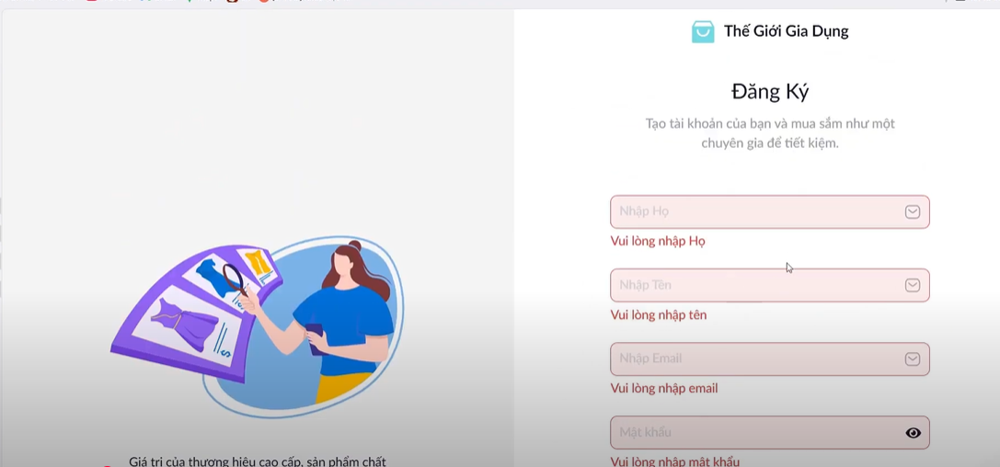
- Browse and search products by category or keyword
- View product details, images, description  
  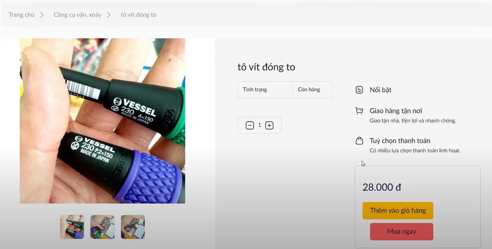
- **Guest Checkout** – Buy products without creating an account  
  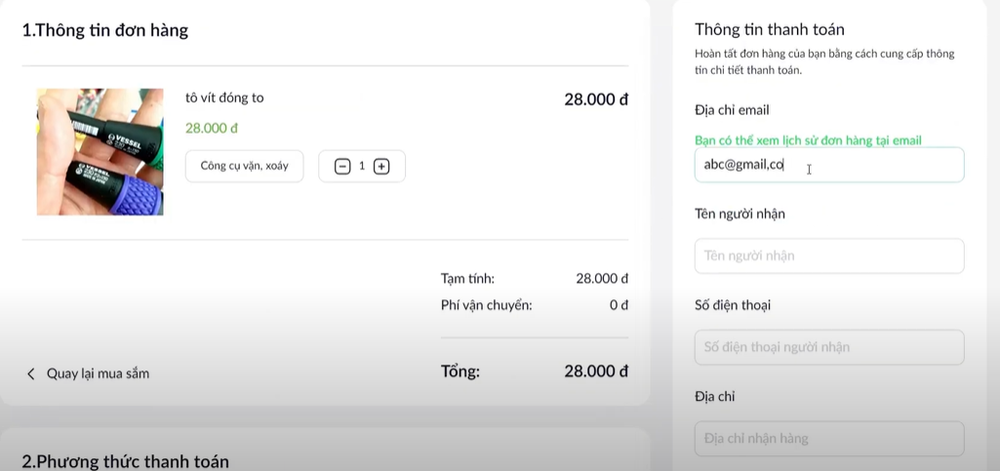
- Add products to cart and manage quantities  
  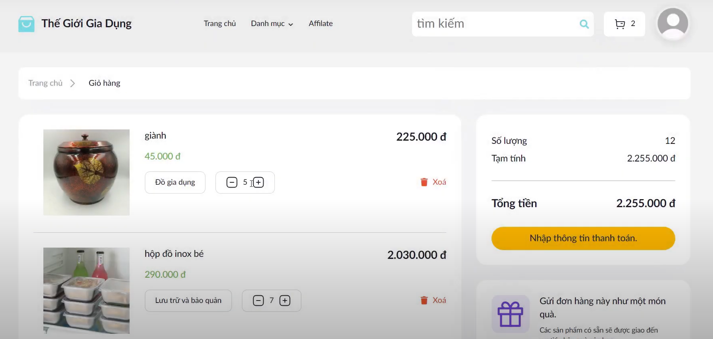
- Place and track orders  
  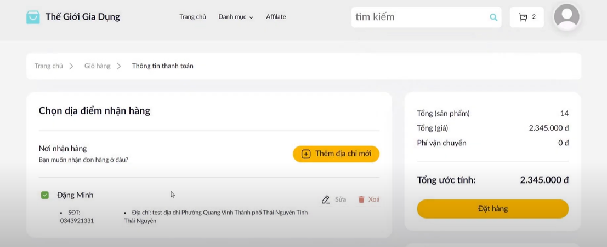
- View order history  
  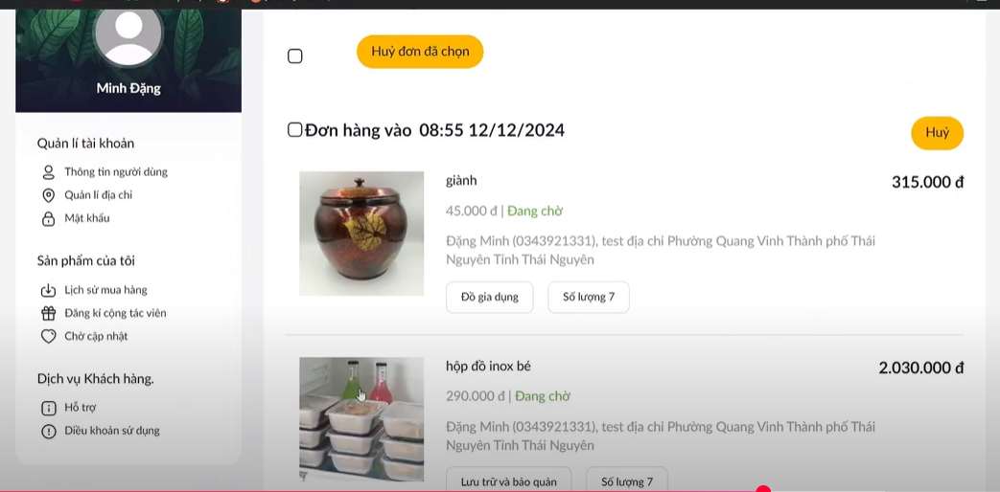
- Access personal **affiliate links** for sharing

### 🧑‍💼 Admin Features
- Admin login
- Manage products (Create, Read, Update, Delete)  
  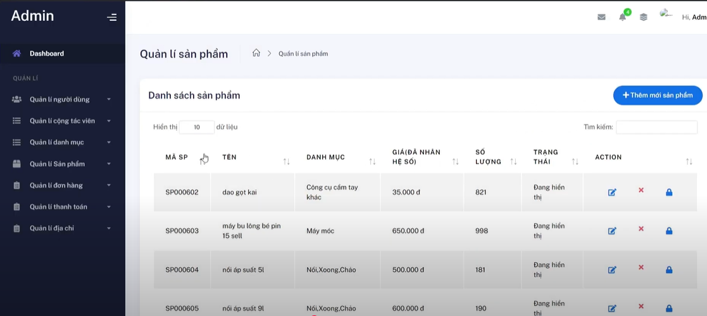
- Manage product categories
- Manage and update order statuses (e.g., confirmed, shipped)  
  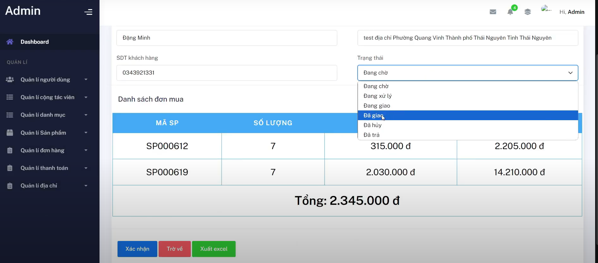
- Manage users  
  
- Manage Affiliate system:
  - Track clicks, affiliate orders
  - Manage commissions and payouts
  
  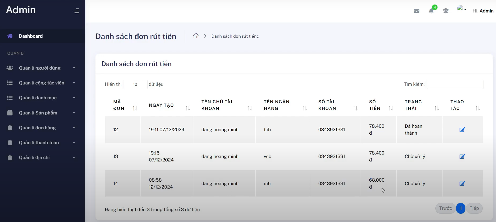

### 🔗 Affiliate Program
- Each user gets a unique affiliate link for every product  
  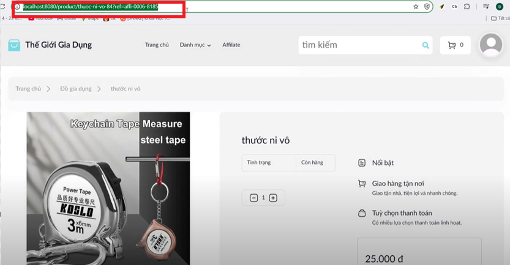
- Earn a percentage commission when someone purchases via your link
- View affiliate dashboard: clicks, conversions, and total earnings  
  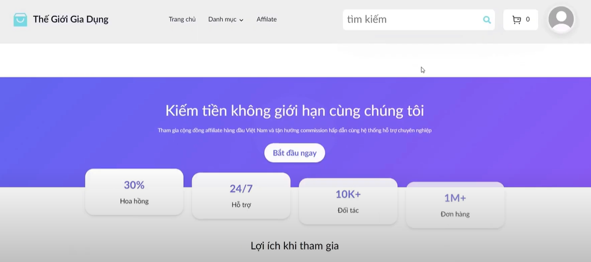  
  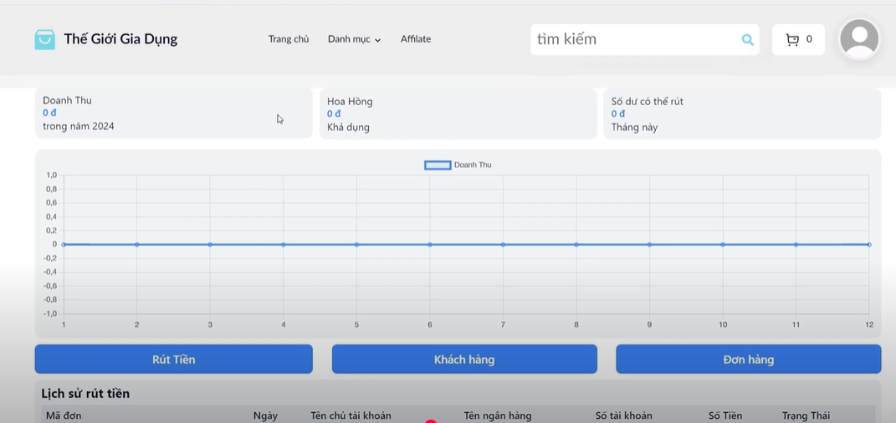

---

## 🧰 Technologies Used

- 🖥️ **Frontend**: Thymeleaf, HTML/CSS, Bootstrap, JavaScript  
- ☕ **Backend**: Java Spring Boot (Spring MVC)  
- 🗄️ **Database**: MySQL  
- 🔐 **Authentication**: Spring Security  
- 📦 **Build Tool**: Maven  
- 🌐 **Affiliate Tracking**: Referral code and cookies

---

## 👨‍💻 Project Author

- 👤 **Developer**: Đặng Hoàng Minh 
- ⏳ **Development Time**: 2 months  
- 🛠️ **Tech Stack**: Java Spring MVC, JSP, Bootstrap, MySQL, Spring Security

> This project was designed and implemented as a solo developer effort, showcasing full-stack development skills from backend to frontend, including affiliate system integration and admin management tools.

---

